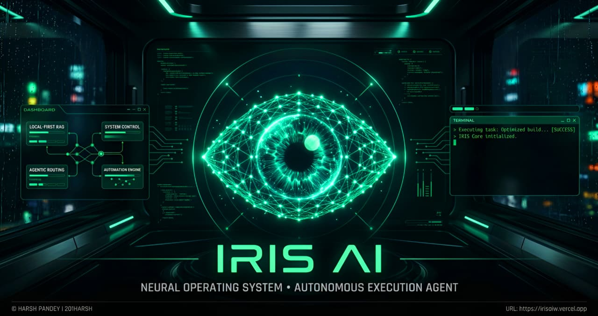

<div align="center">



## The Autonomous Neural OS Agent

<div style="display: flex; justify-center; gap: 10px; margin-bottom: 20px;">
  <a href="https://github.com/vikash/IRIS-AI/stargazers">
    
  </a>
  <a href="https://github.com/vikash/IRIS-AI/network/members">
    
  </a>
  <a href="https://github.com/vikash/IRIS-AI/graphs/contributors">
    
  </a>
  <a href="https://github.com/vikash/IRIS-AI/releases">
    
  </a>
</div>

**A local-first neural execution system that turns intent into real OS actions.**

---

</div>

# 📑 Table of Contents

- [⚡ Overview](#-overview)
- [✨ Core Features](#-core-features)
- [🏗️ Architecture](#️-architecture)
- [💻 Tech Stack](#-tech-stack)
- [🔐 Security](#-security)
- [🚀 Installation & Setup](#-installation--setup)
- [📁 Project Structure](#-project-structure)
- [🧠 Development Philosophy](#-development-philosophy)
- [🤝 Contributing](#-contributing)
- [🧩 Extending IRIS](#-extending-iris)
- [🧠 Roadmap](#-roadmap)
- [⚠️ Disclaimer](#️-disclaimer)
- [👨‍💻 Architect](#-architect)
- [📜 License](#-license)

---

# ⚡ Overview

IRIS is not a chatbot.

It is a **local-first AI Operating System layer** that executes real-world actions across your system, applications, and devices.

> Speak your command. IRIS executes it.

---

# ✨ Core Features & System Capabilities

### 📂 System & File Management

- 🖥️ **Open App:** Native application lifecycle control.
- 🛑 **Close App:** Instant process termination commands.
- 🗂️ **Read Directory:** Local folder scanning & indexing.
- 📁 **Create Folder:** Instant directory structure generation.
- 📄 **Read File:** Deep text & code extraction.
- 📝 **Write File:** Autonomous disk write access.
- 🔄 **Manage File:** Copy, move, and delete control.
- 🚀 **Open File:** Native OS application launcher.
- 🗃️ **Smart Drop Zones:** Viral, autonomous folder sorting.

### 🧠 Vector Search & Local Knowledge

- 🔍 **Index Folder:** Semantic LanceDB directory ingestion.
- 🔎 **Smart File Search:** Vector-based local file retrieval.
- 🖼️ **Read Gallery:** Local image cache scanning.
- 👁️ **Analyze Photo:** Direct multimodal vision processing.

### 💻 Developer & Terminal Tools

- ⌨️ **Run Terminal:** Native shell & CLI execution.
- 🛠️ **Open Project:** Instant IDE workspace loading.
- ⚙️ **Activate Protocol:** Context-aware coding mode switch.
- 🏗️ **Build File:** Writing code directly to disk.
- 🤖 **Execute Sequence:** JSON-based macro automation runs.
- ▶️ **Execute Macro:** Named workflow sequence triggering.
- 🕳️ **Deploy Wormhole:** Expose localhost to public internet.
- 🛑 **Close Wormhole:** Terminate public localhost tunnels.

### 🎯 Desktop UI, Vision & Automation

- 🪟 **Teleport Windows:** Dynamic desktop window management.
- 🧩 **Create Widget:** Spawn live floating desktop components.
- ❌ **Close Widgets:** Clear active floating overlays.
- 🖱️ **Click on Screen:** AI-driven exact coordinate targeting.
- 📜 **Scroll Screen:** Autonomous up/down page navigation.
- ⚡ **Press Shortcut:** Global keyboard hotkey injection.
- 👻 **Phantom Typer:** Global inline clipboard injection.
- ✂️ **Screen Peeler (OCR):** Instant UI-to-code visual extraction.
- ⌨️ **Ghost Coder:** Inline IDE generation (`Ctrl+Alt+Space`).
- 🔊 **Set Volume:** Master audio level control.
- 📸 **Take Screenshot:** Instant visual context capture.

### 💾 Memory & Information

- 🧠 **Save Core Memory:** Deep persistent identity tracking.
- 📥 **Retrieve Memory:** Instant past context recall.
- 📝 **Save Note:** Local markdown note generation.
- 📖 **Read Notes:** Instant saved plan retrieval.
- 📧 **Read Emails:** Gmail inbox scraping & summarization.

### 🌐 Web, Media & Financials

- 🔍 **Google Search:** Live internet data retrieval.
- 🌤️ **Get Weather:** Real-time atmospheric condition checks.
- 🗺️ **Open Map:** Interactive dark-mode map loading.
- 🚗 **Get Navigation:** Real-time routing and directions.
- 🎵 **Play Spotify:** Instant music & playlist execution.
- 📈 **Stock Price:** Real-time financial ticker tracking.
- 📊 **Compare Stocks:** Dual-ticker fundamental market analysis.
- 🕷️ **Hack Live Website:** Viral visual DOM manipulation.
- 🎨 **Build Animated Web:** Agentic Tailwind & GSAP generation.
- 🖼️ **Generate Image:** High-fidelity multimodal media generation.

### 💬 Communications

- 📲 **Send WhatsApp:** Instant automated message dispatch.
- 🕒 **Schedule WhatsApp:** Cron-based delayed message automation.
- 📧 **Draft Email:** Autonomous message composition.
- 🚀 **Send Email:** Action-oriented direct dispatch.

### 📱 Mobile Telekinesis (Deep Android Link)

- 🔔 **Mobile Notifications:** Read texts from connected phone.
- 🔋 **Mobile Info:** Battery & hardware telemetry tracking.
- 📤 **Push File to Mobile:** Seamless PC-to-phone transfers.
- 📥 **Pull File from Mobile:** Instant phone-to-PC fetching.
- 📱 **Open Mobile App:** Remote Android application launching.
- 🛑 **Close Mobile App:** Remote Android process killing.
- 👆 **Tap Mobile Screen:** Remote coordinate touch execution.
- 📜 **Swipe Mobile Screen:** Remote directional scrolling control.
- ⚙️ **Toggle hardware:** Remote Wi-Fi/Bluetooth/Flashlight switching.

### 🕵️ Autonomous Research & Deep RAG

- 🕸️ **Deep Research:** Autonomous Llama 3 web crawling.
- 📓 **Read Notion Reports:** Deep sync with Notion databases.
- 📚 **Ingest Codebase:** Deep local project Vector embedding.
- 🔮 **Consult Oracle:** Deep local codebase RAG queries.

### 🔐 Security & OS Vault

- 🔒 **Lock System Vault:** Standard PIN OS lockdown protocol.
- 🛡️ **Biometric Encryption:** Multi-face recognition OS lockdown.

---

# 🏗️ Architecture

### Frontend

- React + Tailwind + Framer Motion
- Handles UI, commands, voice

### Backend

- Electron (Node.js)
- Full system access (files, automation, sockets)

### IPC Bridge

```js
window.electron.ipcRenderer.invoke('tool-name', payload)
```

---

# 💻 Tech Stack

IRIS is forged using a high-performance stack combining web technologies with deep native OS access and state-of-the-art AI models.

### 🖥️ Core Desktop & UI Framework

- **Electron & Vite:** High-performance desktop compilation and split-process architecture.
- **React 19:** Component-based, responsive frontend.
- **Tailwind CSS v4:** Utility-first styling engine for the Neon Emerald aesthetic.
- **Framer Motion & GSAP:** Cinematic, hardware-accelerated UI animations.
- **Three.js & React Three Fiber:** 3D rendering for complex neural visualizations.
- **Zustand:** Fast, scalable global state management.

### 🧠 AI, RAG & Machine Learning

- **Google Gemini AI:** Core reasoning and generative engine (`@google/genai`).
- **Groq SDK:** Ultra-fast, low-latency inference routing.
- **Hugging Face & Xenova:** Local model inference and transformers (`@huggingface/inference`, `@xenova/transformers`).
- **LanceDB (VectorDB):** Embedded local vector database for deep codebase RAG and memory storage.
- **Face-api.js:** Local biometric facial recognition for the System Vault.

### ⚙️ OS Control & Automation Engine

- **Nut.js:** Deep native desktop automation (mouse, keyboard, exact coordinate targeting).
- **Puppeteer (with Stealth):** Headless browser automation, DOM hacking, and invisible web crawling.
- **Node Window Manager:** Native OS window lifecycle and spatial placement control.
- **Tesseract.js:** Optical Character Recognition (OCR) for the 'Screen Peeler' visual extraction.
- **Native Utilities:** `loudness` (master audio), `clipboardy` (phantom typing), `screenshot-desktop` (visual context).

### 🔗 Integrations & Parsing

- **Google APIs & Auth:** Secure local auth, Gmail scraping, and Google Cloud services.
- **Notion Client:** Direct read/write mapping to Notion databases.
- **Tavily Core:** Agentic, deep-web search routing.
- **Data Parsers:** `pdf-parse`, `mammoth` (docx), `cheerio` (HTML DOM).

---

# 🔐 Security

- 100% BYOK (Bring Your Own Key)
- Local encryption (OS keychain)
- Zero-trust architecture
- No external key storage

---

# 💻 System Requirements

- **OS:** Windows 10 / 11 (Native execution).
- **Memory:** Minimum 4GB RAM (8GB recommended for heavy RAG indexing).
- **Storage:** ~5.2 GB for the application, plus extra space for local LanceDB vector storage.

---

# 🚀 Installation & Setup

### 1. Clone Repo

```bash
git clone https://github.com/vikash/IRIS-AI.git
cd IRIS-AI
```

### 2. Install Dependencies

```bash
npm install
```

---

### 3. Run Dev Server

```bash
npm run dev
```

---

### 5. Initialize Vault

- Open app
- Go to Command Center (Settings)
- Add API keys securely

---

## 🔑 System Keys & Configuration

IRIS operates locally, but requires specific API keys to bridge the gap to large language models and search engines. **Your keys are encrypted and stored locally on your machine. They are never sent to our servers.**

### How to Configure

- **Desktop App Users:** Open IRIS, navigate to the **Settings Tab (Command Center) > API Keys**, and paste your keys directly into the vault.
- **Developers (Running from source):** Rename `.env.example` to `.env` in the root directory and place your keys there for local testing.

### 🔴 Required Keys

The Neural OS requires these core engines to process logic and execute actions.

- **[Google Gemini API](https://aistudio.google.com/app/apikey)** (`GEMINI_API_KEY`)
  - **Role:** The primary reasoning and generative engine for IRIS.
  - **Setup:** Sign in to Google AI Studio > Click 'Get API Key' > Create a key.

- **[Groq API](https://console.groq.com/keys)** (`GROQ_API_KEY`)
  - **Role:** Used for ultra-fast, low-latency agent routing and rapid decision-making.
  - **Setup:** Log in to Groq Cloud Console > Navigate to 'API Keys' > Create & copy your key.

### 🟡 Optional Keys

These keys unlock advanced, autonomous subsystems.

- **[Tavily Search API](https://app.tavily.com/home)** (`TAVILY_API_KEY`)
  - **Role:** Powers the Deep Research agent for real-time web crawling and synthesis.
  - **Setup:** Sign up at the Tavily Portal > Go to Dashboard > Generate a free-tier key.

- **[Hugging Face Token](https://huggingface.co/settings/tokens)** (`HUGGINGFACE_API_KEY`)
  - **Role:** Required only if you are downloading and running local open-source inference models.
  - **Setup:** Create a Hugging Face account > Settings > Access Tokens > Create token with 'Read' permissions.

> 💡 **Having trouble finding your keys?** Visit our official [Key Forging Guide](https://irisaiw.vercel.app/guide) for step-by-step instructions.


# 📁 Project Structure

```text
iris/
├── build/                   # OS-specific build artifacts
├── out/                     # Compiled output ready for packaging
├── resources/               # Static assets (icons, trained data, etc.)
├── src/                     # Core application source code
│   ├── main/                # Electron Main Process (Node.js backend & OS execution)
│   ├── preload/             # Context Isolation Scripts (The IPC secure bridge)
│   └── renderer/            # React Frontend (UI, floating widgets, GSAP animations)
├── .env.example             # Template for API keys and environment variables
├── electron-builder.yml     # Configuration for packaging the .exe / .app / .AppImage
├── electron.vite.config.ts  # Vite configuration for the split architecture
├── eng.traineddata          # Tesseract OCR language data file
└── package.json             # Project dependencies and scripts
```

---

# 🧠 Development Philosophy

- Execution > Conversation
- Modular system design
- Real-world usability

---

## 🤝 Contributing

IRIS is built for the community. If you want to expand the neural forge, submit a PR.

### Quick Start

1. **Fork** the repository.
2. **Branch** off `main`.
3. **Match** existing patterns (Tailwind for UI, strict IPC typing for the backend).
4. **Test** thoroughly (ensure tools do not block the main Electron thread).
5. **Submit** a PR with a clear explanation and visual evidence if altering the UI.

🚨 **Read the full [Contribution Guide](CONTRIBUTING.md) before submitting.**

---

### Commit Rules

Keep your commit messages clean, descriptive, and easy to understand. Clearly state what the commit accomplishes and always include the relevant Issue ID so we can track the changes.

```bash
✅ git commit -m "feat: integrated new desktop widget (#45)"
✅ git commit -m "fix: resolved IPC memory leak in Oracle module (#12)"
```

---

# 🧩 Extending IRIS

You can:

- Add new IPC tools
- Integrate APIs
- Build automation modules
- Extend UI widgets

---

## 🧠 Roadmap

- [ ] Voice-first system
- [ ] Plugin marketplace
- [ ] Memory graph
- [ ] Multi-agent system
- [ ] Desktop + Cloud hybrid

---

# ⚠️ Disclaimer

IRIS has deep system-level execution capabilities.  
Use responsibly. The maintainers are not liable for misuse.

---


# 👨‍💻 Architect

**vikash**  
AI Systems Engineer and Project Leader

Instagram: [@vikash](https://www.instagram.com/vikash/)
GitHub: [@vikash](https://github.com/vikash)

---

# 📜 License

MIT License — see LICENSE file.
[](LICENSE)

---

# 🟥 Final Note

**IRIS is not a chatbot.** It is a **neural extension of your operating system**.

> _System Online._

# Made with ❤️ by [vikash](https://instagram.com/vikash)


---
